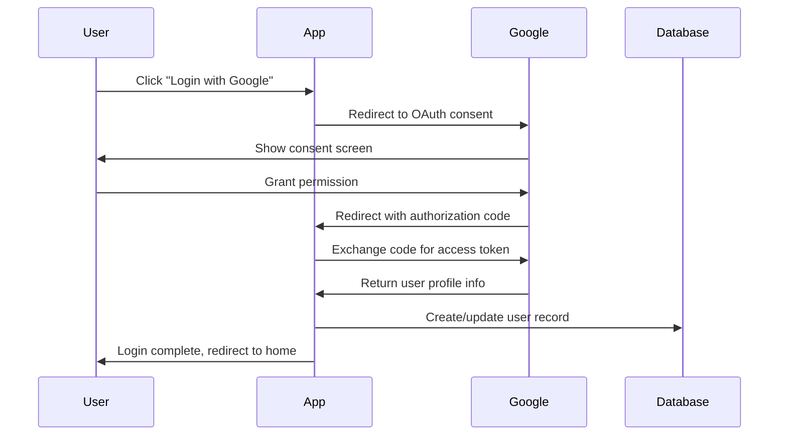

# 🔐 Google Authentication Setup Guide

## Overview
This guide explains how Google authentication has been configured in your BrightLife IMS project and how to complete the setup.

## What's Been Configured

### 1. NuGet Package Added
- ✅ `Microsoft.AspNetCore.Authentication.Google` version 9.0.8

### 2. Program.cs Configuration
The following authentication configuration has been added to your `Program.cs`:

```csharp
// Configure external authentication providers
builder.Services.AddAuthentication()
    .AddGoogle(googleOptions =>
    {
        // Get Google OAuth credentials from configuration
        googleOptions.ClientId = builder.Configuration["Authentication:Google:ClientId"] 
            ?? throw new InvalidOperationException("Google ClientId is not configured");
        googleOptions.ClientSecret = builder.Configuration["Authentication:Google:ClientSecret"] 
            ?? throw new InvalidOperationException("Google ClientSecret is not configured");
        
        // Save tokens for later use (optional)
        googleOptions.SaveTokens = true;
    });
```

### 3. Configuration Structure
Your `appsettings.json` includes placeholders for Google authentication:

```json
{
  "Authentication": {
    "Google": {
      "ClientId": "PLACEHOLDER_GOOGLE_CLIENT_ID",
      "ClientSecret": "PLACEHOLDER_GOOGLE_CLIENT_SECRET"
    }
  }
}
```

## How to Complete the Setup

### Step 1: Get Google OAuth Credentials

1. **Go to Google Cloud Console**: https://console.cloud.google.com/
2. **Create a new project** or select existing project
3. **Enable Google+ API**:
   - Go to "APIs & Services" > "Library"
   - Search for "Google+ API" and enable it
4. **Create OAuth 2.0 Credentials**:
   - Go to "APIs & Services" > "Credentials"
   - Click "Create Credentials" > "OAuth 2.0 Client ID"
   - Choose "Web application"
   - Set authorized redirect URIs:
     - `https://localhost:5211/signin-google` (development)
     - `https://yourdomain.com/signin-google` (production)

### Step 2: Store Credentials Securely

#### For Development (User Secrets - Recommended)
```bash
# Set your actual Google credentials
dotnet user-secrets set "Authentication:Google:ClientId" "your-actual-client-id"
dotnet user-secrets set "Authentication:Google:ClientSecret" "your-actual-client-secret"

# Verify secrets are set
dotnet user-secrets list
```

#### For Production (Environment Variables or Azure Key Vault)
```bash
# Environment variables
export Authentication__Google__ClientId="your-actual-client-id"
export Authentication__Google__ClientSecret="your-actual-client-secret"
```

### Step 3: Test the Integration

1. **Run your application**:
   ```bash
   dotnet run
   ```

2. **Navigate to login**: `https://localhost:5211/Identity/Account/Login`

3. **You should see**: A "Log in with Google" button

4. **Click the button**: It should redirect to Google for authentication

## How It Works

### 1. User Experience Flow
1. User clicks "Login with Google" button on `/Identity/Account/Login`
2. User is redirected to Google's OAuth consent screen
3. User grants permission and is redirected back to your app
4. ASP.NET Core Identity automatically creates or links the user account
5. User is logged in and redirected to the home page

### 2. Technical Flow


### 3. Database Integration
- When a user logs in with Google for the first time, ASP.NET Core Identity automatically:
  - Creates a new `User` record in your database
  - Links the Google account to the user
  - Stores the association in `AspNetUserLogins` table

## Security Considerations

### ✅ What's Secure
- **User Secrets**: Credentials are stored outside your source code
- **HTTPS**: All OAuth flows use secure connections
- **Token Validation**: ASP.NET Core validates all tokens automatically
- **CSRF Protection**: Built-in protection against cross-site request forgery

### 🔒 Additional Security Tips
1. **Never commit secrets** to source control
2. **Use different credentials** for development and production
3. **Regularly rotate secrets** in production
4. **Monitor failed login attempts**
5. **Use Azure Key Vault** for production secrets

## Troubleshooting

### Common Issues

#### 1. "OAuth Error: redirect_uri_mismatch"
**Solution**: Ensure your Google Console redirect URIs match exactly:
- Development: `https://localhost:5211/signin-google`
- Production: `https://yourdomain.com/signin-google`

#### 2. "Google ClientId is not configured"
**Solution**: Verify user secrets are set:
```bash
dotnet user-secrets list
```

#### 3. "This app isn't verified"
**Solution**: This is normal for development. Click "Advanced" → "Go to [app name] (unsafe)"

#### 4. Users can't see the Google login button
**Solution**: Make sure you're using `AddDefaultIdentity<User>()` and the Identity UI is scaffolded

## Advanced Configuration

### Custom Claims Mapping
If you need to map additional Google profile information:

```csharp
.AddGoogle(googleOptions =>
{
    googleOptions.ClientId = builder.Configuration["Authentication:Google:ClientId"];
    googleOptions.ClientSecret = builder.Configuration["Authentication:Google:ClientSecret"];
    googleOptions.SaveTokens = true;
    
    // Map additional claims
    googleOptions.ClaimActions.MapJsonKey("picture", "picture");
    googleOptions.ClaimActions.MapJsonKey("locale", "locale");
});
```

### Custom Callback Handling
To handle post-login logic:

```csharp
googleOptions.Events.OnCreatingTicket = async (context) =>
{
    // Custom logic after successful Google authentication
    var email = context.Principal.FindFirst(ClaimTypes.Email)?.Value;
    var name = context.Principal.FindFirst(ClaimTypes.Name)?.Value;
    
    // Log successful login
    var logger = context.HttpContext.RequestServices.GetRequiredService<ILogger<Program>>();
    logger.LogInformation("User {Email} logged in with Google", email);
};
```

## Commands Reference

```bash
# Initialize user secrets (already done)
dotnet user-secrets init

# Set Google credentials
dotnet user-secrets set "Authentication:Google:ClientId" "your-client-id"
dotnet user-secrets set "Authentication:Google:ClientSecret" "your-client-secret"

# List all secrets
dotnet user-secrets list

# Remove a secret
dotnet user-secrets remove "Authentication:Google:ClientId"

# Clear all secrets
dotnet user-secrets clear

# Run the application
dotnet run
```

## Next Steps

1. ✅ **Google Authentication** - Configured and ready
2. 🔄 **Facebook Authentication** - Can be added similarly
3. 🔄 **Profile Completion** - Guide users to complete their profiles after social login
4. 🔄 **Account Linking** - Allow users to link multiple social accounts
5. 🔄 **Admin Management** - Tools to manage external authentication providers

---

**🔗 Useful Links:**
- [Google Cloud Console](https://console.cloud.google.com/)
- [ASP.NET Core External Authentication](https://docs.microsoft.com/en-us/aspnet/core/security/authentication/social/)
- [User Secrets Documentation](https://docs.microsoft.com/en-us/aspnet/core/security/app-secrets)
